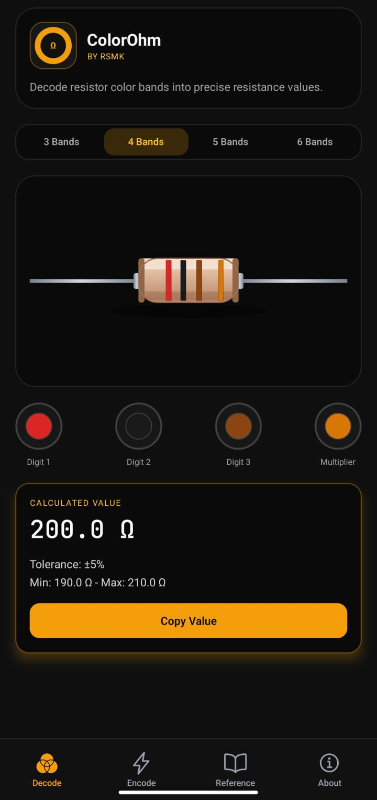
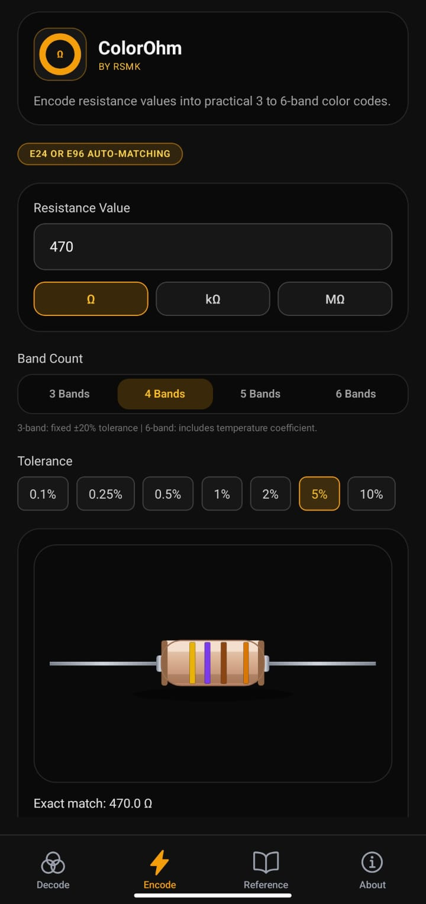
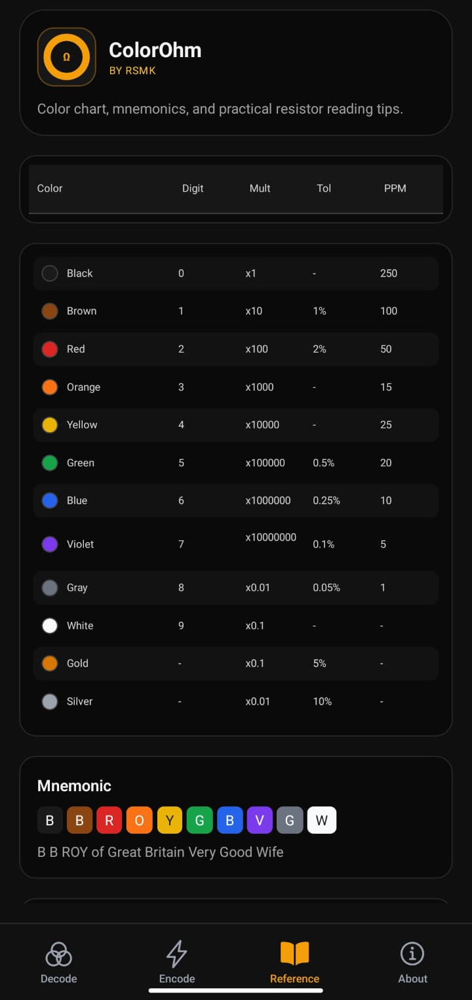
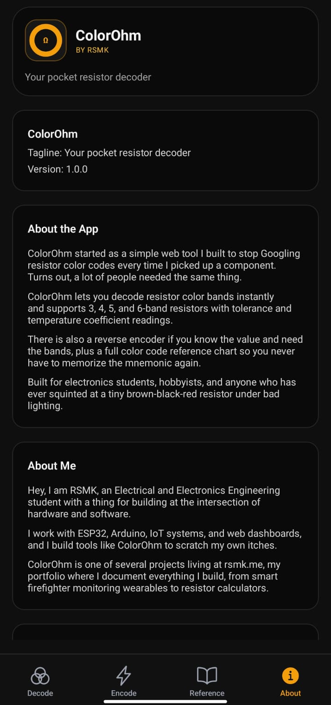

# ColorOhm

ColorOhm is a pocket resistor color-code app for electronics students, hobbyists, and makers.

It helps you:

- Decode resistor bands into resistance values instantly
- Encode resistance values back into 3/4/5/6-band resistor colors
- Use a full color reference chart with digit, multiplier, tolerance, and PPM

## App Workflow

### 1) Decode

Open Decode tab and choose band count (3, 4, 5, or 6).

Select each band color and ColorOhm calculates:

- Exact resistance value
- Tolerance
- Min and max range

You can then copy the computed value with one tap.

### 2) Encode

Open Encode tab and type a resistance value (Omega, kOmega, or MOmega).

Then choose:

- Band count
- Tolerance (and temperature coefficient for 6-band)

ColorOhm finds matching resistor band colors and renders a visual resistor preview.

### 3) Reference

Open Reference tab for the resistor color chart and mnemonic helper.

It includes:

- Digit values
- Multipliers
- Tolerance values
- Temperature coefficient values (PPM)

### 4) About

Open About tab to see app details, version info, project context, and creator profile.

## Screenshots (Real App Screens)

	
	
	
	

